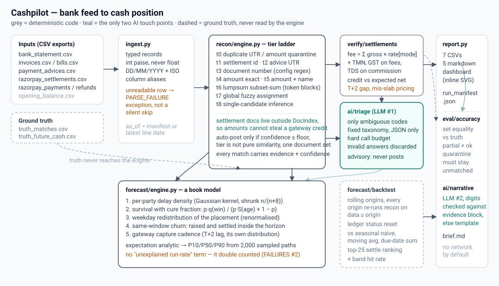

# Cashpilot

**The books, run by itself.** Cashpilot reconciles a bank feed against the sales ledger and the
purchase ledger, verifies Razorpay settlement batches to the paisa, and forecasts the cash position
7 / 14 / 30 days ahead with a probability band and a funding recommendation.

It is built for the part that actually hurts in a small Indian business: the ₹4,50,000 credit in
the HDFC statement that could be invoice INV-2026-00123, or the two invoices the customer paid in
one lumpsum, or the gateway batch where the fee slab was wrong. Nobody reconciles those by hand
every day, so the treasurer runs the business without knowing what cash arrives next month.

```
1,709 bank lines in 1.5 s   →   97.4% reconciled correctly at 99.7% precision
                                1,535 auto-posted at 100% precision, 266 exceptions listed for a human
30-day cash forecast        →   1.8% error (share of money that moved), 50% better than a seasonal naive
which invoices clear?       →   82.2% of the model's top-25 predictions were right; ranking by size gets 14.7%
```

Three rules shape the whole repo:

1. **Deterministic where arithmetic is enough.** Matching is a tiered rule ladder, settlement
   verification is integer paise arithmetic, the forecast is a learned delay distribution. No model
   touches money.
2. **AI only where judgement is the task** — two calls, both advisory: adjudicating ambiguous
   exceptions and writing the daily brief. No key, no network, same pipeline.
3. **Measured, not asserted.** Every accuracy number here comes from a command in
   [docs/ACCURACY.md](docs/ACCURACY.md), scored against planted ground truth on synthetic books that
   were deliberately messed up. [docs/FAILURES.md](docs/FAILURES.md) documents what did not work, with
   before/after numbers.

---

## Run it in ten minutes

Python 3.10+ (3.13 used here), one runtime dependency.

```bash
git clone <this repo> && cd cashpilot
python3 -m venv .venv && source .venv/bin/activate      # optional but recommended
pip install -r requirements.txt                          # numpy only; dev extras for tests
cp .env.example .env                                     # optional: everything works with no keys

python -m cashpilot demo --data data/sample --out artifacts/demo
```

That single command generates a small synthetic company (120 days of trading, ~700 bank lines,
planted errors), runs the whole pipeline, writes the reports, then benchmarks three strategies and
backtests the forecaster. It takes about 20 seconds.

Open:

| file | what it is |
|---|---|
| `artifacts/demo/dashboard.html` | self-contained page: cash path with P10–P90 band, flow by day, exception mix, settlement findings. No CDN, no network — it renders from a file:// URL. |
| `artifacts/demo/brief.md` | the one-paragraph morning brief |
| `artifacts/demo/reconciliation.md` | matches by tier, and every line that was refused, with the reason |
| `artifacts/demo/settlements.md` | per-batch fee/GST/TDS/TMN recompute, over/under-credit |
| `artifacts/demo/forecast.md` | 7/14/30-day position, worst day, funding need, and which invoice the money is expected from |
| `artifacts/demo/aged_receivables.csv` | the collections list: overdue documents ranked by money at risk |
| `artifacts/demo/bench.md` | the accuracy table below, on the same corpus |

### The other four commands

```bash
python -m cashpilot run --data data/synthetic --out artifacts --runs 2000 --backtest
python -m cashpilot bench --data data/synthetic --reps 3 --forecast --seeded   # accuracy + speed table
python -m cashpilot forecast --data data/synthetic --horizon 30 --backtest     # forecast only
python -m cashpilot doctor --data data/synthetic                               # environment + data check

# regenerate the published corpus from scratch (byte-identical to the one in data/synthetic):
python -m cashpilot generate --out data/synthetic --scale medium --seed 20260905 --as-of 2026-09-05
# a harder stress run, ~4,000 lines - no accuracy numbers are published from it
python -m cashpilot generate --out /tmp/stress --scale large --seed 20260905 --as-of 2026-09-05
python -m cashpilot bench --data /tmp/stress --reps 1
```

`make demo`, `make test`, `make bench`, `make doctor`, `make data` do the same things with the flags we
use in CI. `data/synthetic` (the 1,709-line corpus) and `data/sample` (the demo corpus) are committed,
so the accuracy commands work before you generate anything.

To point it at real exports instead of the generator, drop CSVs with the same columns into a
directory — `src/cashpilot/ingest.py` is the only file that knows about column names, and it accepts
`amount_in|credit` / `amount_out|debit`, `txn_date|date`, `narration|description`, and DD/MM/YYYY or
ISO dates. Rows it cannot read become `PARSE_FAILURE` exceptions rather than being dropped.

---

## Architecture



```
 CSV / export files                        ┌──────────────────────────────┐
 bank_statement.csv  invoices.csv  ... ──►│ ingest  (pandas-free, per-row  │
                                          │ tolerance: bad row → exception)│
                                          └───────────────┬────────────────┘
                                                          ▼
        ┌─────────────────────────────────────────────────────────────────┐
        │ recon.engine — tiered ladder, each tier consumes only what it     │
        │ t0 duplicates → t1 settlement → t2 advice/UTR → t3 doc number →   │
        │ t4 amount → t5 amount+name → t6 lumpsum (subset-sum) → t7 fuzzy    │
        │ → t8 single-candidate inference      deterministic, integer paise  │
        └───────────────┬─────────────────────────────────┬─────────────────┘
                        ▼                                 ▼
        verify.settlements                     ai.triage  (LLM, advisory only,
        fee/GST/TDS/TMN recompute               hard call budget, answers
        to config/fee_schedule.json             validated then discarded)
                        │                                 │
                        └────────────┬────────────────────┘
                                     ▼
                     forecast.engine  — per-party empirical delay
                     distribution + survival/cure model + weekday
                     seasonality + same-window churn + gateway cadence
                     (analytic expectation, Monte-Carlo for P10/P90)
                                     ▼
                     report.py — 7 CSVs, run_manifest.json, accuracy.json,
                     5 markdown reports, inline-SVG dashboard.html
```

Why a ladder instead of one clever matcher: the cheap, unambiguous evidence must be exhausted first
so that the expensive, statistical tiers only ever see real residue. That is what makes the
auto-post precision 1.000 — and it makes the *cost* of each tier measurable
(`t6_lumpsum` is 289 ms of the 481 ms reconcile on the large corpus, and it buys 5 lines; we would
drop it on a 500-line month, and the stage timings in `run_manifest.json` are what tell you that).

Details in [docs/ARCHITECTURE.md](docs/ARCHITECTURE.md).

---

## Measured accuracy and speed

Scored on the committed `data/synthetic` corpus: 1,709 bank lines, 2,365 documents (2,029 with a
bank-visible movement), 5,853 gateway payments, 174 settlement batches — seed `20260905`, as-of
2026-09-05. Reproduce exactly with `python -m cashpilot bench --data data/synthetic --reps 3 --forecast
--seeded`; every figure below is copied out of the `artifacts/bench.md` that command writes.

**Reconciliation** — a line is `correct` only if the *whole set* of documents it covers matches ground
truth; matching one invoice of a three-invoice lumpsum is scored as `partial`, not as a win.

| strategy | what it is | precision | recall | F1 | auto-post precision | rupee accuracy | engine ms | lines/s |
|---|---|---|---|---|---|---|---|---|
| `exact` | regex refs + UTR + settlement id only | 0.9978 | **0.5341** | 0.6958 | 1.000 | 0.4725 | ~160 | ~10,600 |
| `fuzzy_only` | + amount, name-similarity, subset-sum, inference | 0.9957 | 0.8391 | 0.9107 | 1.000 | 0.9047 | ~745 | ~2,300 |
| `full` | the shipped ladder | **0.9969** | **0.9743** | **0.9855** | **1.000** | 0.9657 | ~475 | ~3,500 |

*Exact reference/amount matching resolves 53% of the feed. The tiered ladder resolves 97.4% of it, and
refuses the other 2.6% loudly instead of guessing.* Full run: 1,709 lines end-to-end including CSV
ingest, ground-truth scoring, verification, triage and a 2,000-path Monte-Carlo forecast in
**~1,500 ms** (1,532 ms in the run that produced `artifacts/`), of which CSV ingest alone is 751 ms.
Engine times vary ~10% run to run, so they are rounded here; accuracy does not vary at all.

**Forecast** — rolling origin, every origin re-runs reconciliation on data up to that date (no
look-ahead), scored against what the feed then shows:

| model | err, 7d | err, 14d | err, 30d | MAE of net change @30d | skill vs naive | right direction |
|---|---|---|---|---|---|---|
| cashpilot | 9.1% | 5.1% | **1.8%** | ₹30.6 L | **+50.0%** | 100% |
| same-weekday seasonal naive | 10.1% | 8.7% | 3.6% | ₹61.2 L | — | 100% |
| 4-week moving average | 10.8% | 10.0% | 7.3% | ₹1.21 Cr | −97.5% | 100% |
| sum of amounts due in window | 14.0% | 7.8% | 4.6% | ₹77.0 L | −26.0% | 100% |

Error is |forecast − actual| net movement as a share of the money that actually moved in the window;
a percentage of *net* change is unstable (on a zero-flow Sunday it is either 100% or infinite), which
is why it is not the headline. P10–P90 band hit rate: 88.9% / 100% / 100% at 7/14/30 days.

The part a flow-based baseline cannot do at all: **of the 25 documents the model expected to settle
inside a 30-day window, 82.2% really did** — against 14.7% for the same open book ranked by size
alone. [docs/ACCURACY.md](docs/ACCURACY.md) has the per-tier breakdown, the exception list and the
three forecast failures that got us here.

---

## What it does not do (known limitations)

* **It is not a book of record.** Cashpilot reads CSV exports and writes reports; it never posts a
  journal entry, never modifies an invoice, and never initiates a payment. "Auto-posted" means
  *matched with enough confidence that a human can accept it in one click*, and the ledger files on
  disk are untouched.
* **Day-level shape is weaker than the total.** Cumulative 30-day error is 1.8% of gross movement,
  but only ~1 in 30 days lands within 20% of the planned daily net: the model spreads money
  smoothly while reality clusters it at month ends and after the Sunday skip. Trust the total and the
  band; treat a single day's number as a nudge.
* **The daily path under-forecast inflow early** (−5% at 7d, −16% at 14d, −2% at 30d on the seeded
  corpus): collections land slightly later than the learned distribution says.
* **Outflow is over-called at the window edge** (+12% at 30d) — `roll_forward` past Sundays is not
  modelled for payables inside the horizon.
* **`fuzzy_only` is slower than `full`** (~745 ms vs ~475 ms engine time): with the cheap tiers off,
  far more lines reach the global name-assignment step. Real, measured, and a good argument for the
  ladder's ordering.
* **Synthetic world, real arithmetic.** Messiness (truncated narrations, missing refs, short
  deductions, duplicate postings, lumpsums, mis-tiered fees, dropped refund rows) is planted by
  `src/cashpilot/synth/world.py` from a fixed seed. It is not your bank's format, and
  `config/fee_schedule.json` is a *placeholder* rate card — replace it with your contracted slab.
* **Gateway-side coverage is Razorpay-shaped.** Payment/refund/settlement CSV column names follow the
  Razorpay export; another aggregator needs a new loader, not a new engine.
* **Live API fetching is not implemented.** `RAZORPAY_KEY_ID/SECRET` are read by `.env.example`
  only to show where they would go; nothing in this repo calls that API.

---

## Configuration

Everything the finance team might want to change lives in two JSON files; no rate, window or
threshold is hard-coded in Python.

| file | knobs |
|---|---|
| `config/recon_rules.json` | invoice-number regexes, date windows per tier, amount tolerance, name-similarity floors, lumpsum limits, duplicate rules, auto-post floor, `cash_policy` (horizons, MC runs, operating minimum, hazard, weekday redistribution), AR aging recovery curve |
| `config/fee_schedule.json` | gateway rate per payment mode, GST on fees, TDS on commission, TMN, per-batch tolerance in paise, expected settlement lag and gap-alert days |

```bash
python -m cashpilot run --data <dir> --rules /path/to/our_rules.json
```

The LLM is off unless `CASHPILOT_LLM_ENABLED=1` **and** a key is present; when enabled it is capped at
`CASHPILOT_LLM_MAX_CALLS` calls per run and its answers are validated before use
([docs/AI_JUDGEMENT.md](docs/AI_JUDGEMENT.md)).

---

## Layout

```
src/cashpilot/
  ingest.py          CSV → typed records; unreadable rows become exceptions, not silence
  models.py money.py norm.py config.py
  recon/engine.py    the tier ladder, DocIndex, subset-sum lumpsum, global fuzzy assignment
  verify/            settlement fee/GST/TDS/TMN recompute
  forecast/          seasonality, per-party delay curves, survival model, Monte Carlo, backtest
  ai/                llm.py (stdlib client), triage.py, narrative.py
  eval/              accuracy.py (scoring contract), bench.py (strategies × reps → bench.md)
  pipeline.py report.py cli.py
  synth/world.py     the generator, including the mess it plants
tools/generate_synthetic.py  thin wrapper around `cashpilot generate`
tests/               93 tests: tiers, arithmetic, forecast maths, AI scope, CLI end-to-end
config/  docs/  diagrams/  data/{sample,synthetic}/  artifacts/
```

`requirements.txt` pins `numpy==2.3.5` — used for percentile and kernel maths in the forecaster. The
reconciler, verifier and report writer are stdlib-only by design; `pandas`, `scikit-learn`,
`transformers` and every agent framework are deliberately absent.

## Licence

MIT.
